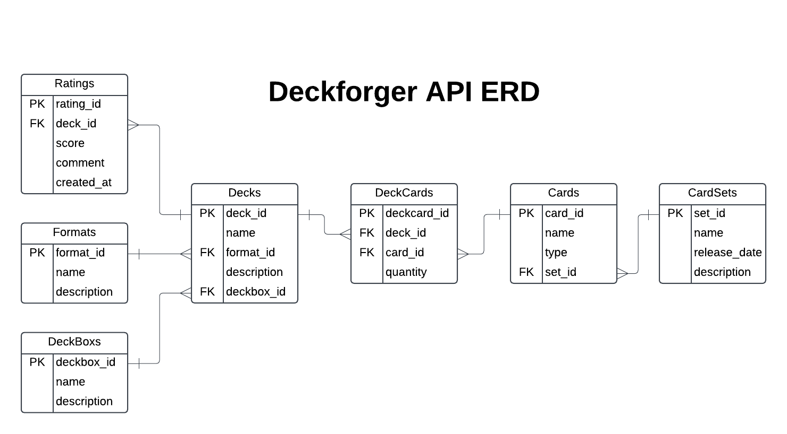

# Pokemon TCG Deck Builder API

A Flask-based REST API for managing Pokemon Trading Card Game decks, collections and formats.

## Features

- Deck Management (Create, store, and organize Pokemon TCG decks)
- Format Validation (Standard, Expanded, Unlimited)
- Card Database (Search and manage Pokemon cards)
- Deck Box Organization
- Deck Rating System

## Tech Stack

- Python
- Flask
- SQLAlchemy
- Marshmallow
- PostgreSQL

## Installation

1. Clone the repository
2. Create and activate virtual environment
3. Install dependencies:

```bash
pip install -r requirements.txt
```

4. Set up environment variables in .env file
5. Initialize database:

```bash
flask run/create
flask run/seed
```

## API Endpoints

### CLI Operations

- POST /run/create - Create database tables
- POST /run/drop - Drop database tables
- POST /run/seed - Seed database with initial data
- POST /run/cleanup - Clean up database
- GET /health - Check API health
- GET /routes - List all available routes

### Decks

- POST /api/decks/ - Create new deck
- PUT /api/decks/{deck_id} - Update deck
- GET /api/decks/validate/{deck_id} - Validate deck rules

### Deck Boxes

- POST /api/deckboxes/ - Create deck box
- GET /api/deckboxes/ - List all deck boxes
- GET /api/deckboxes/{deckbox_id} - Get specific deck box
- PUT /api/deckboxes/{deckbox_id} - Update deck box
- DELETE /api/deckboxes/{deckbox_id} - Delete deck box
- GET /api/deckboxes/{deckbox_id}/decks - List decks in box
- POST /api/deckboxes/{deckbox_id}/decks - Add deck to box
- DELETE /api/deckboxes/{deckbox_id}/decks/{deck_id} - Remove deck from box

### Cards

- POST /api/cards/ - Create card
- GET /api/cards/ - List all cards
- GET /api/cards/{card_id} - Get specific card
- PUT /api/cards/{card_id} - Update card
- DELETE /api/cards/{card_id} - Delete card
- GET /api/cards/search - Search cards

### Deck Cards

- POST /api/deckcards/{deck_id}/cards - Add cards to deck
- GET /api/deckcards/{deck_id}/cards - View cards in deck
- DELETE /api/deckcards/{deck_id}/cards/{card_id} - Remove card from deck
- PUT /api/deckcards/{deck_id} - Update deck cards

### Card Sets

- POST /api/cardsets/ - Create set
- GET /api/cardsets/ - List all sets
- GET /api/cardsets/{cardset_id} - Get specific set
- PUT /api/cardsets/{cardset_id} - Update set
- DELETE /api/cardsets/{cardset_id} - Delete set
- GET /api/cardsets/search - Search sets

### Formats

- GET /api/formats/ - List all formats
- GET /api/formats/{format_id} - Get specific format
- POST /api/formats/ - Create format
- PUT /api/formats/{format_id} - Update format
- DELETE /api/formats/{format_id} - Delete format

### Card Types

- GET /api/cardtypes/ - List all card types
- GET /api/cardtypes/{cardtype_id} - Get specific card type
- POST /api/cardtypes/ - Create new card type
- PUT /api/cardtypes/{type_id} - Update card type
- DELETE /api/cardtypes/{type_id} - Delete card type

### Deck Ratings

- POST /api/ratings/ - Create new rating
- GET /api/ratings/ - List all ratings
- GET /api/ratings/{rating_id} - Get specific rating
- PUT /api/ratings/{rating_id} - Update rating
- DELETE /api/ratings/{rating_id} - Delete rating

## Database Schema



## Usage Examples

### Creating a New Deck

```python
# Create a Standard format deck
POST /api/decks
{
    "name": "Charizard Control",
    "description": "Fire-type control deck",
    "format_id": 1
}
```

### Adding Cards to a Deck

```python
# Add cards with quantities
POST /api/decks/{deck_id}/cards
[
    {
        "card_id": 5,
        "quantity": 4
    },
    {
        "card_id": 11,
        "quantity": 20
    }
]
```

### Rating a Deck

```python
# Add a rating with comment
POST /api/decks/{deck_id}/ratings
{
    "score": 5,
    "comment": "Great deck composition!"
}
```

### Searching Cards

```python
# Search for Fire-type cards
GET /api/cards/search?cardtype=fire

# Search by set
GET /api/cards/search?cardset_id=1
```

### Managing Deck Boxes

```python
# Create a new deck box
POST /api/deckboxes
{
    "name": "Tournament Decks",
    "description": "Competition-ready decks"
}

# Add deck to deck box
POST /api/deckboxes/{deckbox_id}/decks
{
    "name": "Championship Deck",
    "format": "Standard"
}
```

### Format Validation

```python
# Validate deck format legality
GET /api/decks/validate/{deck_id}
```

## Contributing

Development is ongoing. Contributions are welcome! But please allow for grading before I accept pull requests.

Main Developer: Shane W Miller

## License

Copyright (c) 2024 Shane W Miller

Permission is granted, free of charge, to use this software solely for educational purposes as part of Coder Academy coursework and assessment requirements.

All other rights are reserved. This software may not be:

- Used for commercial purposes
- Modified or distributed outside of educational requirements
- Used in any way not directly related to course assessments

Any use of this software must maintain this copyright notice and license terms.

For permissions beyond educational use, contact shanemiller@iinet.net.au .
